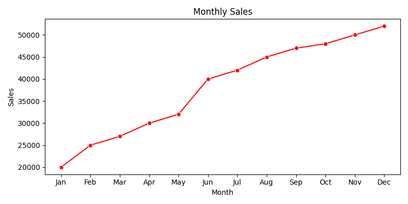
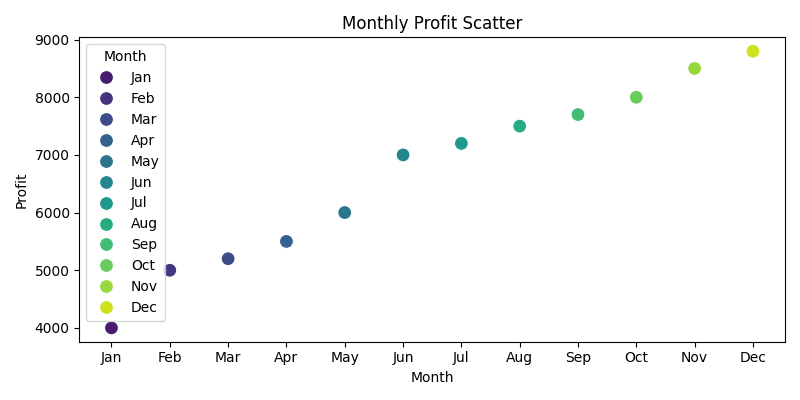
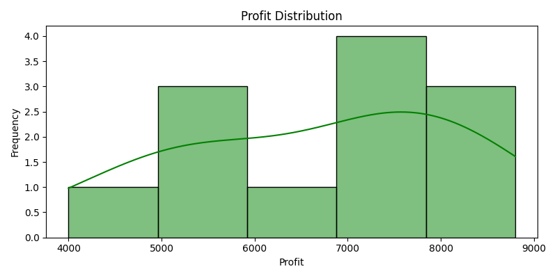
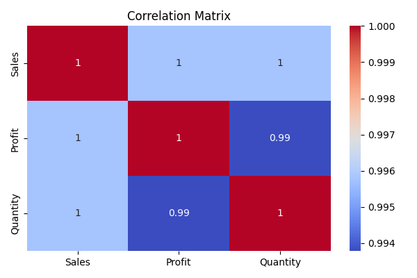

# 📊 Sales Data Analysis using Python (Pandas, Matplotlib & Seaborn)

This project analyzes **monthly sales, profit, and quantity** data using Python.
It demonstrates how **data visualization** can help in understanding sales trends, performance, and relationships between key metrics.


## 🧠 Project Overview

The goal of this project is to:

* Visualize sales and profit trends over 12 months
* Analyze profit distribution and product quantity
* Study correlations between numeric variables
* Practice Python data analysis and visualization libraries


## 🗂️ Project Structure

```
📂 Sales-Data-Analysis
 ┣ 📜 main.py                       # Main Python code
 ┣ 📊 monthly_sales.png             # Line plot (Sales trend)
 ┣ 📊 monthly_profit.png            # Scatter plot (Profit trend)
 ┣ 📊 profit_distribution.png       # Histogram (Profit distribution)
 ┣ 📊 correlation_matrix.png        # Heatmap (Correlation matrix)
 ┗ 📘 README.md                     # Project documentation


## 🧩 Libraries Used

| Library        | Purpose                                     |
| -------------- | ------------------------------------------- |
| **pandas**     | For data handling and creation of DataFrame |
| **matplotlib** | For static data visualizations              |
| **seaborn**    | For advanced and aesthetic plots            |

Install all dependencies:

```bash
pip install pandas matplotlib seaborn
```

## 📈 Visualizations

### 1️⃣ Monthly Sales Trend

Shows how sales increased over the year.



### 2️⃣ Monthly Profit Scatter Plot

Visualizes profit variation month-to-month.



### 3️⃣ Profit Distribution

Displays frequency distribution of profit values.




### 4️⃣ Correlation Matrix

Highlights relationships among numeric variables.




## 🚀 How to Run the Project

1. Clone this repository

   ```bash
   git clone https://github.com/<ishalangehh-wq/Sales-Data-Analysis.git
   
2. Open the folder in VS Code / Jupyter Notebook
3. Run:

   ```bash
   python main.py
   
4. The generated PNG charts will appear in your project folder.


## 💡 Insights

* Sales and profit show a positive growth trend.
* High correlation between **Sales**, **Profit**, and **Quantity** indicates consistent performance.
* Data visualization helps in identifying seasonal performance trends.

---

## 👩‍💻 Author

**Isha Langeh**
*Aspiring Data Analyst | Python | Pandas | Seaborn | Matplotlib*
🌐 [GitHub Profile](https://github.com/<ishalangehh-wq)
📧 [ishalangeh@example.com](mailto:ishalangeh@example.com) *(optional)*


